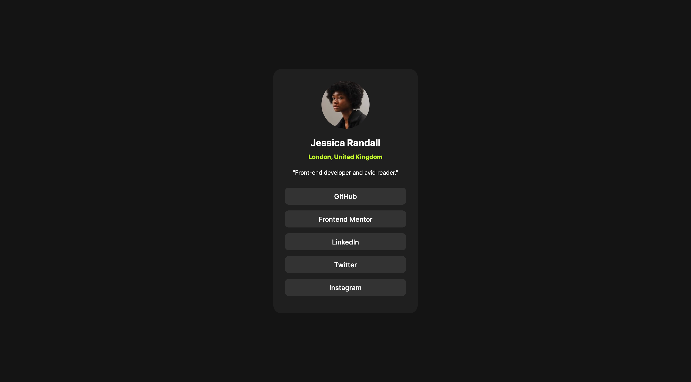

# Frontend Mentor - Social links profile solution

This is a solution to the
[Social links profile challenge on Frontend Mentor](https://www.frontendmentor.io/challenges/social-links-profile-UG32l9m6dQ).
Frontend Mentor challenges help you improve your coding skills by building
realistic projects.

## Table of contents

- [Overview](#overview)
  - [The challenge](#the-challenge)
  - [Screenshot](#screenshot)
  - [Links](#links)
- [My process](#my-process)
  - [Built with](#built-with)
  - [What I learned](#what-i-learned)
- [Author](#author)
- [Acknowledgments](#acknowledgments)

## Overview

### The challenge

Users should be able to:

- See hover and focus states for all interactive elements on the page

### Screenshot

### Links

- Solution URL:
  [https://github.com/jamespask/social-links-profile](https://github.com/jamespask/social-links-profile)
- Live Site URL:
  [https://jamespask.github.io/social-links-profile/](https://jamespask.github.io/social-links-profile/)

## My process

### Built with

- Semantic HTML5 markup
- CSS custom properties

### What I learned

This helped me brush up on some basic HTML and CSS, I really do need to get a
pro subcripton again though as its rather difficult to work without the design
file.

## Author

- Frontend Mentor -
  [@jamespask](https://www.frontendmentor.io/profile/jamespask)
